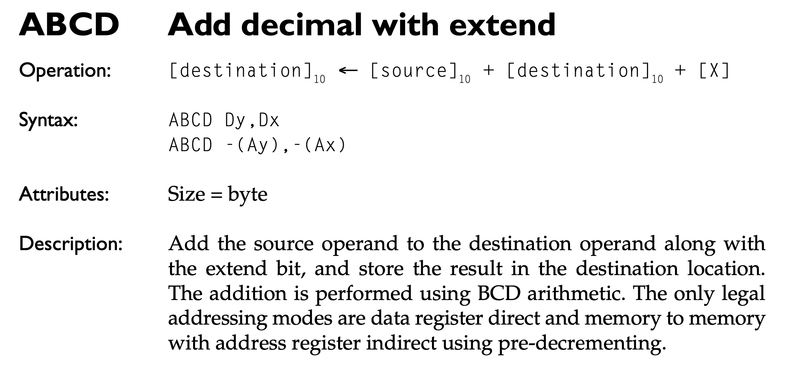

# Instruction handlers

This article explains the inner workings of a typical instruction handler. All instruction handlers are stored in a large lookup table. The previous article showed how Moira retrieves the handler from the table and calls it via a function pointer call. 

To get an idea of how a typical command handler is structured, let's see how the ABCD command is implemented: 



The following handler implements the register addressing variant of the ABCD instruction:

```c++
template <Core C, Instr I, Mode M, Size S> void
Moira::execAbcdRg(u16 opcode)
{
    AVAILABILITY(C68000)

    int src = _____________xxx(opcode);
    int dst = ____xxx_________(opcode);

    u32 result = bcd<C, I, Byte>(readD<Byte>(src), readD<Byte>(dst));

    prefetch<C, POLL>();
    SYNC(2);
    writeD<Byte>(dst, result);

    //           00  10  20        00  10  20        00  10  20
    //           .b  .b  .b        .w  .w  .w        .l  .l  .l
    CYCLES_DN   ( 6,  6,  4,        0,  0,  0,        0,  0,  0)

    FINALIZE
}
```

All instruction handlers are declared with four template arguments:
- `Core C`: The emulated CPU core
- `Instr I`: The emulated instruction
- `Mode M`: The emulated addressing mode
- `Size S`: The size attribute of the instruction

In case of the `ABCD Dy,Dx` instruction, the template arguments are instantiated as follows: 
- `C` equals `C68000`, `C68010` or `C68020`, depending on the emulated CPU model
- `I` equals `ABCD`
- `M` equals `MODE_DN`
- `S` equals `BYTE`

All instruction handlers begin and end with a special macro called `AVAILABILITY` and `FINALIZE`, respectively. The `AVAILABILITY` macro expands to a series of assertion checks that verify the integrity of template parameter `C`. In addition, delegation function `willExecute` is called if the statement is among the observed instructions, as specified in `MoiraConfig.h`. 

In the next two lines, the source and destination registers are extracted from the opcode. Then the `bcd` function is called, which emulates the core functionality of the ABCD instruction.

The next line instructs Moira to emulate the prefetch operation. Like many other functions, `prefetch` accepts an optional template argument that can be used to alter the inner workings of this function. In this example, the `POLL` flag is passed, which causes Moira to query the IPL pins in the middle of the prefetch operation.

After that, the result of the `bcd` operation is written into the destination register by calling `writeD`. 

The next code section is only relevant in simple cycle mode. In this mode macro `CYCLES_DN` is expanded to a suitable call of `sync`. In our example, it expands to `sync(6)` when emulating a M68000 or M68010, and to `sync(4)` for all other models. In precision timing mode, the macro expands into an empty statement, because the `sync` calls have already been issued in the correct places in the instruction handler code.

Like all instruction handlers, the instruction handler for the ABCD command ends with the `FINALIZE` macro. It is responsible for calling the delegation function `didExecute` if Moira has been configured to do so in `MoiraConfig.h`.  
