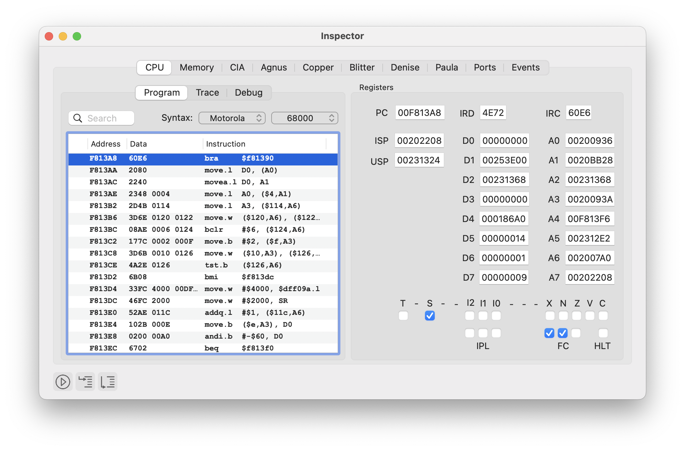
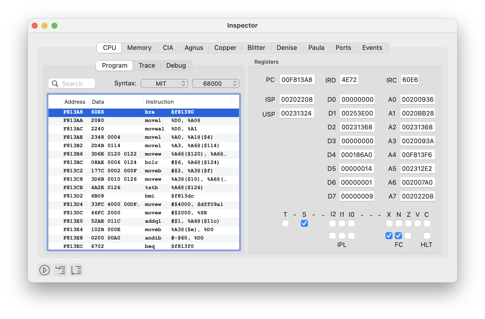

# How to use the disassembler

## Running the disassembler 

Moira features a built-in disassembler which allows to create textual representations for instructions, the program counter and the status register. Textual representations can be created with the following API functions: 

- `int disassemble(u32 addr, char *str) const`

    This functions disassembles the command at the specified address. It is the responsibility of the caller to ensure that the target string is initialized and large enough to hold the generated string. The function returns the number of bytes that the disassembled instruction occupies in memory.  

- `void disassembleWord(u32 value, char *str) const`

    Returns a textual representation for a single word from memory. 

- `void disassembleMemory(u32 addr, int cnt, char *str) const`

    Returns a textual representation for one or more words from memory.

- `void disassemblePC(u32 pc, char *str) const`

    Creates a textual representation for the passed-in value of the program counter. If the first parameter is omitted, the current value of the program counter is disassembled.

- `void disassembleSR(const StatusRegister &sr, char *str) const`

    Creates a textual representation for the referenced status register. If the first parameter is omitted, the current status register is disassembled.

## Customizing output

The disassembler output can be customized in various ways by calling one of the following API functions:

- `void setDasmSyntax(DasmSyntax value)` 

    Moira supports the following syntax styles: 
    - `DASM_MOIRA`
        This is the default syntax style. It prints the instructions in Motorola syntax.
    - `DASM_MOIRA_MIT` 
        This is a Moira-specific style that prints the instructions in MIT syntax. 
    - `DASM_GNU`
        This style resembles the output of the m68k disassembler integrated in `binutils`. 
    - `DASM_GNU_MIT`
        This style mimics the output of `binutils` when run in MIT mode. 
    - `DASM_MUSASHI`
        This style reproduces the Musashi disassembler output one-by-one. 

- `void setDasmNumberFormat(DasmNumberFormat value)`

    The number format can be controlled by a variety of parameters which are grouped together in a singe struct: 

    ````c++
    struct DasmNumberFormat
    {
        const char *prefix;     // Prefix for hexidecimal numbers
        u8 radix;               // 10 (decimal) or 16 (hexadecimal)
        bool upperCase;         // Lettercase for hexadecimal digits A...F
        bool plainZero;         // Determines whether 0 is printed with a prefix
    };
    ````

- `void setDasmLetterCase(DasmLetterCase value)`

    The letter case determines the appearance of mnemonics and register names. The following options are availabe: 
    - `DASM_MIXED_CASE`
        The style is determined by the selected syntax style. 
    - `DASM_LOWER_CASE`
        All mnemonics and register names are printed in lowercase.
    - `DASM_UPPER_CASE`
        All mnemonics and register names are printed in uppercase.
    
- `void setDasmIndentation(int value)`

    Defines the tabulator space between the mnemonic and the rest of the instruction. 

## Examples

- Running Moira in vAmiga with syntax style `DASM_MOIRA`
    

- Running Moira in vAmiga with syntax style `DASM_MOIRA_MIT`
    

