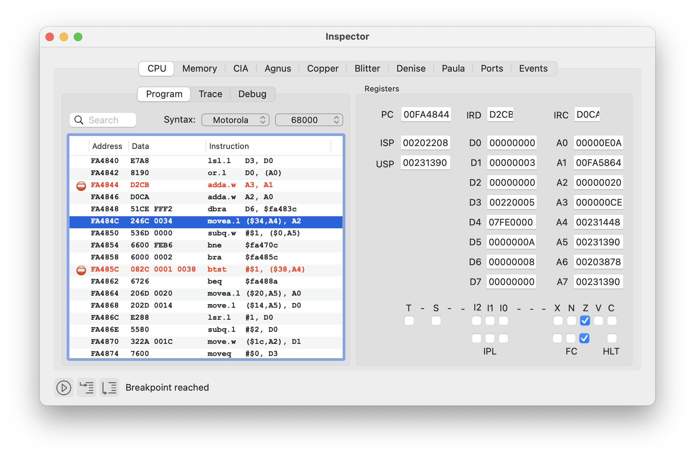

# About

Moira is a Motorola 68000, 68010, 680EC20, and 68020 emulator written in C++. The emulator is compatible with macOS, Linux, and Windows. The source code of the core emulator is published under the term of the MIT license. Moira is the heart of [vAmiga](https://dirkwhoffmann.github.io/vAmiga), a high-precison emulator for the classic Commodore Amiga models.

## Design goals 

Moira has been written with three goals in mind:

- **Accuracy**

  Moira provides high emulation accuracy, both functionally and temporally. It was designed for Amiga emulation which does not only require exact cycle counts, but memory accesses being performed at the proper DMA cycles.

- **Efficiency**

  The architecture of Moira is geared towards high emulation speed. To achieve this goal, the emulator is written entirely in C++ and makes extensive use of templates. Moira surpasses the emulation speed of Musashi, which belongs to the fastest M68k emulators ever developed.

- **Portability**

  The source code is compatible with all common C++ compilers, namely Clang, Gcc, and MSVC. It can be compiles flawlessly on macOS, Linux, and Windows. Furthermore, the source code is compatible with WebAssembly which makes Moira a first-class candidate for being used in web-based applications.

## History

Before I started the vAmiga project in early 2019, I informed myself about the existing Motorola 68k emulators at the time. What I was looking for was a throughly tested emulator with high emulation speed and good code quality. I did find such an emulator in the form of Musashi, written by Karl Stenerud, which is being used successfully in the Mame project for many years now. 

I had been using Musashi in vAmiga for roughly a year until I realized that it lacks one important feature: Precise inter-instruction timing. In order to emulate the memory bus of the Amiga with high precision, I needed to know the number of cycles that had elapsed, for example, between the beginning of a command execution and the first or second access of the memory bus. Like most 68k emulators, Musashi only provides the total number of CPU cycles that has been consumed by the execution of a single instruction. Because cycle-exact bus timing is a crucial aspect for Amiga emulation, I came to the conclusion that more sophisticated timing control was needed to bring vAmiga to the next level. 

My search for a new CPU core had drawn my attention to the Portable68000 emulator and its successor Denise m680x0, both written by "PiCiJi". These emulators offer inter-instruction timing and thus exactly what I needed for pushing the vAmiga project forward. However, Denise wasn't thoroughly tested back then, but already far superior to portable68000 from a software-architectural point of view. At this point I decided to implement my own CPU based on the three CPU cores I already knew. In fact Musashi, Portable68000 and Denise m680x0 can be considered the intellectual ancestors of my CPU implementation: Moira imitates much of the concepts the three other emulators are based on. Externally, Moira might appear a bit like a clone of Musashi, because the first releases mimiced Musashi's disassembler output down to the last character. Internally, Moira exhibits many similarities with Denise m680x0. For example, it provides the same sync function that is being used by Portable68000 and Denise to count the number elapsed cycles between bus accesses.

## Credits

Nanos gigantum humeris insidentes. I am grateful to
- Karl Stenerud for writing [Musahi](https://github.com/kstenerud/Musashi), 
- PiCiJi for writing Denise [m680x0](https://bitbucket.org/piciji/denise/src/master/emulation/processor) and [portable68000](https://sourceforge.net/projects/portable68000), and
- Toni Wilen for writing [cputester](https://eab.abime.net/showthread.php?t=98747).
